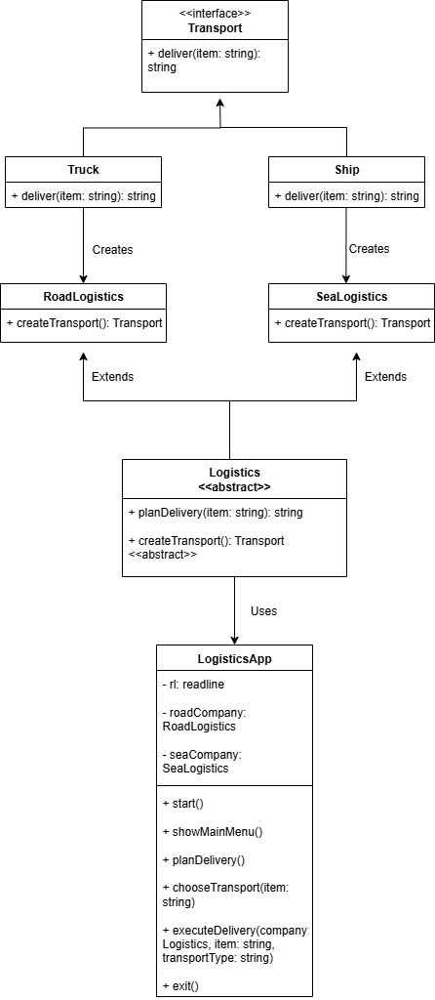

# Factory Method Pattern - Logistics System

A TypeScript implementation of the Factory Method design pattern using an interactive console interface with a logistics company example.

## Overview

The Factory Method pattern provides an interface for creating objects without specifying their exact class. This implementation demonstrates the pattern through a logistics management system that supports different transportation methods.

## UML Class Diagram



## Pattern Structure

- **Product Interface**: `Transport` - defines the common interface for all transport types
- **Concrete Products**: `Truck`, `Ship` - specific implementations of transport
- **Abstract Creator**: `Logistics` - declares the factory method
- **Concrete Creators**: `RoadLogistics`, `SeaLogistics` - implement the factory method
- **Client**: `LogisticsApp` - uses the factory pattern

## Project Structure

```
├── Transport.ts          # Transport interface
├── Truck.ts             # Road transport implementation
├── Ship.ts              # Sea transport implementation
├── Logistics.ts         # Abstract logistics base class
├── RoadLogistics.ts     # Road logistics factory
├── SeaLogistics.ts      # Sea logistics factory
├── main.ts              # Interactive console application
├── package.json         # Project configuration
├── tsconfig.json        # TypeScript configuration
└── README.md           # Documentation
```

## Installation

1. Clone the repository

   ```bash
   git clone <repository-url>
   cd factory-method-logistics
   ```

2. Install dependencies
   ```bash
   npm install
   ```

## Usage

### Development Mode

```bash
npm run dev
```

### Production Mode

```bash
npm run build
npm start
```

## How It Works

1. The application presents a menu for delivery planning
2. User selects what to deliver and transportation method
3. The appropriate logistics company creates the correct transport vehicle
4. The vehicle executes the delivery using its specific method

### Code Flow Example

```typescript
// User selects road delivery
const company = new RoadLogistics();

// Factory method in action
const result = company.planDelivery("Pizza");

// Behind the scenes:
// 1. planDelivery() calls createTransport()
// 2. RoadLogistics.createTransport() returns new Truck()
// 3. Truck.deliver() executes and returns delivery message
```

## Output

When you run the application, you'll see an interactive console interface:

```
🏭 Welcome to Factory Method Logistics!
========================================
🚛 We deliver by road and sea 🚢

📋 What would you like to do?
1. Plan a delivery
2. See our transport options
3. Exit

Choose an option (1-3): 1

📦 Plan Your Delivery
--------------------
What do you want to deliver? Pizza

🚚 How should we deliver your Pizza?
1. 🚛 By road (fast for nearby locations)
2. 🚢 By sea (cost-effective for far locations)
3. 🔙 Back to main menu

Choose transport method (1-3): 1

⚡ Processing your delivery...
------------------------------
✅ 🚛 Truck delivers Pizza by road
💡 Note: We used road logistics company
   The factory method created the right vehicle automatically!

🔄 Plan another delivery? (y/n): n

📋 What would you like to do?
1. Plan a delivery
2. See our transport options
3. Exit

Choose an option (1-3): 3

🎉 Thank you for using Factory Method Logistics!
📚 You've seen the Factory Method pattern in action:
   • Same delivery planning process
   • Different vehicles created automatically
   • Easy to add new transport types

Goodbye! 👋
```

## Key Benefits

- **Extensibility**: Easy to add new transport types
- **Loose Coupling**: Client code doesn't depend on concrete classes
- **Single Responsibility**: Each class has a focused purpose
- **Open/Closed Principle**: Open for extension, closed for modification

## Extending the System

To add a new transport type (e.g., Air transport):

1. Create `Plane.ts` implementing `Transport` interface
2. Create `AirLogistics.ts` extending `Logistics` class
3. Update `main.ts` to include the new option

Example:

```typescript
// Plane.ts
export class Plane implements Transport {
  deliver(item: string): string {
    return `Plane delivers ${item} by air`;
  }
}

// AirLogistics.ts
export class AirLogistics extends Logistics {
  createTransport(): Transport {
    return new Plane();
  }
}
```

## Dependencies

- Node.js (≥14.0.0)
- TypeScript (≥5.0.0)

## Built By

Ms Hamsini S
